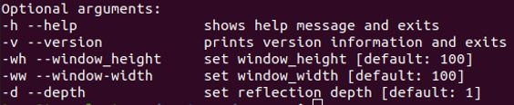
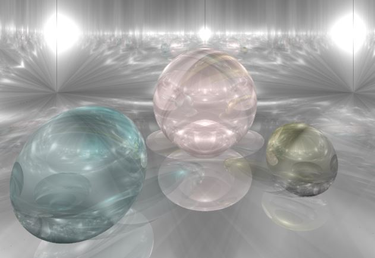

# raytrace
This repository demonstrates raytracing by implementing interaction between 'point light' & 'sphere and plane'. This started as raytracing project for my 2018-1 CG class. 
Legacy branch includes MSVC project, but is no longer maintained. Default compile environment is now Linux/Ubuntu.

# Prerequisite
To compile the code, you simply need 'g++'. Although this code is based on freeglut, all necessary files are included in the source.

# How to Run
go to 'sources' directory, and simply run 'make'. 
This will make a binary 'out'. Simply run by typing './out' to run the program with default settings. 
Currently, following optional parameters are supported. 

# Example
Included code as is features 3 spheres under 3 different light source in the reflective room, with x9 anti-alising. 
Since this code uses only CPUs, rendering may take a while. Please check the command prompt to check the progress, and run under 'release' mode (not 'debug') for faster rendering.  

